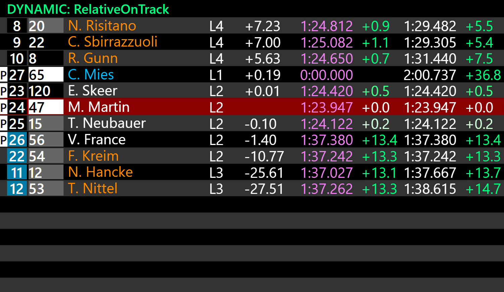
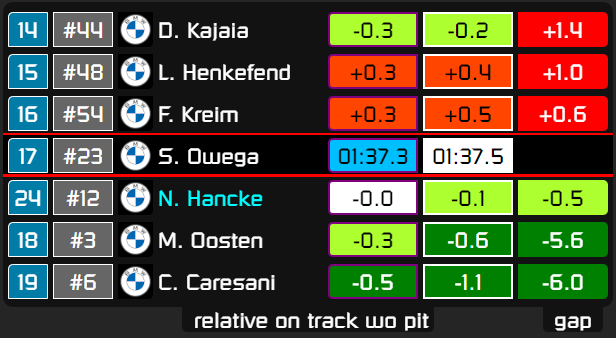

!!! Info

    If you have created a dashboard and would like it to be discoverable here, open up a request as described in [Feature requests and suggestions](requests.md).

{{ dashTitle("DynLeaderboards Example", "Kaius Loos") }}
: Simple leaderboard meant to be used on smartphones. *This is the leaderboard provided with this plugin.*

{: style="max-height:300px;margin-left:auto;margin-right:auto;display:block;"}
    

{{ dashTitle("SimHub gaps overlay", "serek4") }}
: Beautiful modern overlay with specialized race and qualy modes. More details at [Overtake](https://www.overtake.gg/downloads/simhub-gaps-overlay.51841/), [Github](https://github.com/serek4/simhub-gaps-overlay).

{: style="max-height:250px;margin-left:auto;margin-right:auto;display:block;"}

