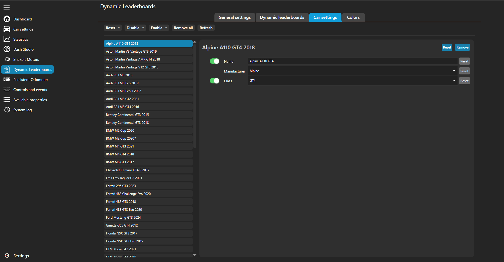

# Configuration

??? info "Terminology"

    **Leaderboard type**
    : a single kind of leaderboard like overall or relative on track.

    **Dynamic leaderboard**
    : a collection of "leaderboard types" that you can easily switch between.
    
        In this plugin you can configure multiple "dynamic leaderboards" that contain different "leaderboard types" and expose different properties.

This plugin provides bunch of configuration options. 
By default the plugin is configured to run provided "DynLeaderboard" dash with a dynamic leaderboard named "Dynamic" but you can add more.
    
Go to the plugin settings either directly from the left main menu "Dynamic Leaderboards" item or under "Additional plugins" item go to "DynLeaderboardsPlugin" tab.

## General settings

This tab includes settings that are global to the whole plugin and all properties listed here will be available globally.

#### PATHS

There are couple of paths needed for the plugin to work.

"ACC configuration location"
: is used to read connection information from the broadcasting client.
    
    We need to find the file {{ path("..\\Assetto Corsa Competizione\\Config\\broadcasting.json") }}.
    Likely the correct location is {{ path("C:\\Users\\<user name>\\Documents\\Assetto Corsa Competizione") }}

"AC root location"
: is used to read car data. This is useful for modded cars so you don't have to manually enter all the necessary data.

    We need to find the folder {{ path("..\\assettocorsa\\content\\cars") }}. 
    Likely the correct location is {{ path("C:\\Program Files (x86)\\Steam\\steamapps\\common\\assettocorsa") }}.

If the background of text box is green then we found needed files. If it's red then there is something wrong with the location.

If you needed to change the location, restart SimHub for the changes to take effect.

## Dynamic leaderboards

This is the tab where you can configure all of the dynamic leaderboards.

#### DYNAMIC LEADERBOARDS

This section allows to select which dynamic leaderboard is currently configured.
You can also add and remove dynamic leaderboards.

The toggle button in front of each leaderboard allows to disable calculation of given dynamic leaderboard. 
This can be useful if you have many leaderboards installed but only use some of them at a time.
You can disable the ones not used at the moment in order to not waste resources.

You can change the name by opening the dropdown menu and writing inside the corresponding box. 
Then all properties will be available as `DynLeaderboardsPlugin.<chosen name>.<pos>.<property name>`. 
For example you named your dynamic leaderboard as "MyDynLeaderboard" then you can do 
`DynLeaderboardsPlugin.MyDynLeaderboard.5.Car.Number` to get the fifth car's number in whatever leaderboard type is currently. 
If it's overall order you get the fifth car overall, if it's on track relative leaderboard you get the car that is in fifth position in that order.

#### LEADERBOARD ROTATION

Here you define the specific leaderboard types that appear in the dynamic leaderboard and choose the order of appearance. 

You can also enable removing some leaderboard types if there is only a single class or cup in the session. Overall and class/cup leaderboards are equivalent in a single class/cup sessions and thus there is really no need to scroll through all of them if they are all enabled.

!!! TIP 

    You don't need to restart SimHub after the changes made to the rotation.

For leaderboard definitions see the [reference](../reference/leaderboards.md).

#### CONTROLS

This section allows to assign controls for "Next leaderboard" and/or "Previous leaderboard"
which move between the leaderboards enabled in the rotation section. 
"Next leaderboard" will move down the list and "Previous leaderboard" up the list.

#### NUMBER OF POSITIONS

!!! note "Notes"

    * For relative positions we set the number of positions shown ahead and behind. That if if set to 5 for example, we show 5 cars ahead and 5 cars behind the focused car.
    * The driver indices are set such that current driver is always first. If you set the number of drivers to 1, then we only show current driver.
  
#### PROPERTIES FOR EACH CAR

Enable/disable properties for currently selected dynamic leaderboard. Each property can be accessed as `DynLeaderboardsPlugin.<dynamic leaderboard name>.<pos>.<property name>`.

#### PROPERTIES FOR EACH DRIVER

These can be accessed as `DynLeaderboardsPlugin.<dynamic leaderboard name>.<pos>.Driver.<driver number>.<property name>`, for example `DynLeaderboardsPlugin.Dynamic.5.Driver.1.FirstName`.

#### Closing notes

After you reached the end, restart SimHub for the changes to take effect and start creating your own dashboard or enjoy the provided one.
If you are creating your own dashboard make sure to give [Creating dashboards](creating_dashboards.md) page at least a quick read.

## Car settings

This tab provides an option to change car names, manufacturers and classes. 
All the available cars are listed on the left. 
If the plugin detects a new car while in game it will be added to the list but for now you'll
need to manually refresh the list by clicking the "Refresh" button.
A new car will be added in disabled state but most of the times reasonable defaults will be provided
for easy customization.

#### Fallback and defaults

The options have a three level system: SimHub data, base data and user overrides.

* At the bottom there is SimHub's data which is used if the property is not available from the plugin side.
This includes if the property is disabled or the car is missing from the plugin. 
Note that "Manufacturer" property cannot be disabled as SimHub doesn't provide it.
By default the manufacturer is the first word of the car name but this is not perfect.
However next two levels can fix it.

* Next there is base plugin data which is either bundled by the plugin in the download or it's generated from game files.
At the moment base data is provided for ACC (which matches v1.x data) and it can be generated for AC ([more information about it](#read-car-information)).

* Finally a user can override any of the car settings.

!!! tip "TL;DR"

    In the car settings menu if a property is enabled then whatever text is in text box will be used.
    If the property is disabled then SimHub's data will be used.

#### Reset or remove

The menu also provides options to "reset" or "remove" options.
These two can be a bit confusing, so what's the difference.

"reset"
: will revert back to whatever state is the plugins default. 
    This means that if base data was provided by the plugin then it will be used.
    If there is no base data then SimHub's data will be used.
    The car won't be removed from the list.

"remove"
: will try to remove the setting or car completely. 
    This always results in SimHub's data being used.

    Note that if base data is available the car won't be completely removed from the list
    but only disabled. However the effect is same, SimHub's data will be used.

For example since this plugin provides base data for ACC, "reset" will restore 
the values to that base data, whereas "remove" will fall back to SimHub's data.
Both will keep the cars listed.
However for AMS2 there is no base data, so "reset" and "remove" effectively 
do the same thing -- fall back to SimHub's data except "remove" will also
remove the car's from the list while "reset" doesn't.

## Colors

This tab allows to customize any of the colors provided by the plugin.
This includes class, team cup category and driver category colors.

Each color has background and foreground part which are also shown in a little preview box.

Again as with "Car settings" tab if the plugin detects new classes or categories
they will be added to the list but for now you'll need to manually refresh the 
list by clicking the "Refresh" button.

The colors also have same three level fallback system as "Car settings".
Also "reset" and "remove" mean exact same things.

## Game specific config

<!-- ### Assetto Corsa Competizione

* Check plugin settings for correct "ACC configuration location" under "General settings".  
    If it's background is green, then we found needed files, if it's red there's something wrong with the location. 
  
    We need to find the file {{ path("..\\Assetto Corsa Competizione\\Config\\broadcasting.json") }}.
    Most likely the correct location is {{ path("C:\\Users\\\<user name>\\Documents\\Assetto Corsa Competizione") }}.
  
    It is used to read information needed to connect to ACC broadcasting client.

* If you needed to change the location, restart SimHub. -->

### Assetto Corsa

#### Read car information
   
This plugin can read the default car information directly from AC's car files (from {{ path("..\\assettocorsa\\content\\cars\\\<car_id>\\ui\\ui_car.json")}}).
This is useful for modded cars so you don't have to manually enter all the necessary data.

For it to function you need to set correct "AC root location".

* Check plugin settings under "General settings".  
    If it's background is green, then we found needed files, if it's red there's something wrong with the location.

    We need to find the folder {{ path("..\\assettocorsa\\content\\cars") }}. Likely the correct location is {{ path("C:\\Program Files (x86)\\Steam\\steamapps\\common\\assettocorsa") }}.

    If you needed to change the location, restart SimHub.

If the plugin detects that there is no base AC car data, it will try to automatically read it.
However for further update you need to manually trigger the update. 
This is so that we don't accidentally trigger and expensive update during a session when unknown car joins.

To update the base info go to the plugin settings and under "Car settings" tab click "Update base info" button.
:material-information-outline:

!!! info

    Last thing to note here is the way classes are read.
    By default most AC cars have class of either "race" or "street".
    However their actual class is represented in tags as "#class" (for example "#GT3-GTE").
    Thus if the car's class if "race" or "street" the plugin will look at tags and first tag of format "#class" is used as the class.

All this means that there are two ways to change car information in AC. 
Either from the plugin menu or by modifying AC files directly which Content Manager makes this very easy.

--8<-- "includes/abbreviations.md"