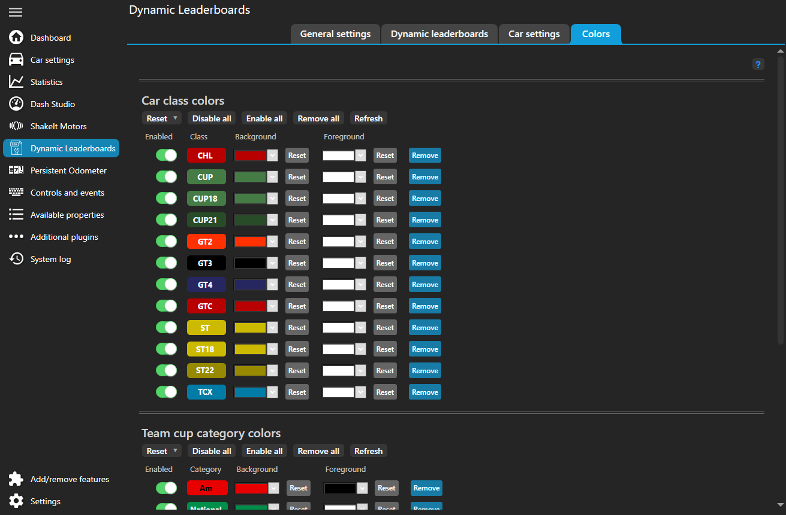

# Configuration

??? info "Terminology"

    **Leaderboard type**
    : a single kind of leaderboard like overall or relative on track.

    **Dynamic leaderboard**
    : a collection of "leaderboard types" that you can easily switch between.
    
        In this plugin you can configure multiple "dynamic leaderboards" that contain different "leaderboard types" and expose different properties.

This plugin provides bunch of configuration options.
Go to the plugin settings either directly from the left main menu "Dynamic Leaderboards" item or under "Additional
plugins" item.
Each section in SimHub menu has a little help button which directly links to the relevant section in here.

Below is the documentation for all the available options.

## General settings

This tab includes settings that are global to the whole plugin.

#### PATHS

There are couple of paths needed for the plugin to work.

!!! note
These are game specific and if you don't play that specific game you can safely ignore that setting.

If the background of text box is green then we found needed files. If it's red then there is something wrong with the
location.

"ACC configuration location"
: is used to read connection information from the broadcasting client.

    We need to find the file {{ path("..\\Assetto Corsa Competizione\\Config\\broadcasting.json") }}.
    Likely the correct location is {{ path("C:\\Users\\<user name>\\Documents\\Assetto Corsa Competizione") }}

"AC root location"
: is used to read car data. This is useful so you don't have to manually enter all the necessary data.

    We need to find the folder {{ path("..\\assettocorsa\\content\\cars") }}. 
    Likely the correct location is {{ path("C:\\Program Files (x86)\\Steam\\steamapps\\common\\assettocorsa") }}.

If you needed to change the location, restart SimHub for the changes to take effect.

#### EXPOSED PROPERTIES

All properties listed here will be available globally (not tied to specific dynamic leaderboard).

The SimHub menu provides a short description for each property.
For more detailed description see [the reference](../reference/properties.md#general).

#### DEBUG

These setting can be useful when reporting issues with the plugin.
For normal use it's recommended to keep everything in this section disabled.

If you are experiencing issues, then see [troubleshooting](../community/troubleshooting.md) page.

## Dynamic leaderboards

This is the tab where you can configure all of the dynamic leaderboards.

#### DYNAMIC LEADERBOARDS

This section allows to select which dynamic leaderboard is currently configured.
You can also add and remove dynamic leaderboards.

The toggle button in front of each leaderboard allows to disable calculation of given dynamic leaderboard.
This can be useful if you have many leaderboards installed but only use some of them at a time.
You can disable the ones not used at the moment in order to not waste resources.

You can change the name by opening the dropdown menu and writing inside the corresponding box.
Then all properties will be available as `DynLeaderboardsPlugin.<chosen name>.<pos>.<property name>`.
For example you named your dynamic leaderboard as "MyDynLeaderboard" then you can do
`DynLeaderboardsPlugin.MyDynLeaderboard.5.Car.Number` to get the fifth car's number in whatever leaderboard type is
currently.
If it's overall order you get the fifth car overall, if it's on track relative leaderboard you get the car that is in
fifth position in that order.

#### LEADERBOARD ROTATION

Here you define the specific leaderboard types that appear in the dynamic leaderboard and choose the order of
appearance.

You can also enable removing some leaderboard types if there is only a single class or cup in the session.
Overall and class/cup leaderboards are equivalent in a single class/cup sessions and thus there is really no need to
scroll through all of them if they are all enabled.

!!! TIP

    You don't need to restart SimHub after the changes made to the rotation.

For leaderboard type definitions see [the reference](../reference/leaderboards.md).

#### CONTROLS

This section allows to assign controls for "Next leaderboard" and/or "Previous leaderboard"
which move between the leaderboards enabled in the rotation section.
"Next leaderboard" will move down the list and "Previous leaderboard" up the list.

!!! info

    For mapping to controller inputs you need to enable "Controllers input" plugin and to keyboard inputs "Keyboard Input" plugin.

#### NUMBER OF POSITIONS

Here you can limit the number of positions exported since there is no need to export more than your leaderboard can
display.

For relative positions we set the number of positions shown ahead and behind.
That is if set to 5 for example, we show 5 cars ahead and 5 cars behind the focused car.

The driver numbers are set such that current driver is always first.
If you set the number of drivers to 1, then we only show current driver.

#### PROPERTIES FOR EACH CAR

Enable/disable properties for currently selected dynamic leaderboard.
Each property can be accessed as `DynLeaderboardsPlugin.<dynamic leaderboard name>.<pos>.<property name>`.

The SimHub menu provides a short description for each property.
For more detailed description see [the reference](../reference/properties.md#for-each-car).

#### PROPERTIES FOR EACH DRIVER

These can be accessed as
`DynLeaderboardsPlugin.<dynamic leaderboard name>.<pos>.Driver.<driver number>.<property name>`. `<driver number>`
starts at 1 and that always corresponds to the current driver. For example
`DynLeaderboardsPlugin.Dynamic.5.Driver.1.FirstName` will get the first name of the current driver of the 5th car.

The SimHub menu provides a short description for each property.
For more detailed description see [the reference](../reference/properties.md#for-each-driver).

#### Closing notes

After you reached the end, restart SimHub for the changes to take effect and start creating your own dashboard or enjoy
the provided one.
If you are creating your own dashboard make sure to give [Creating dashboards](creating_dashboards.md) page at least a
quick read.

## Car settings

This tab provides an option to change car names, manufacturers and classes.
All the available cars are listed on the left.
The listed name is the model name exported by the plugin.
An id used by SimHub is listed as small text below.

If the plugin detects a new car while in game it will be added to the list but for now you'll
need to manually refresh the list by clicking the `Refresh` button.
This is so that we don't build unnecessary UI elements when they are not viewed and we are actually racing.
A new car will be added in disabled state but most of the times reasonable defaults will be provided
for easy customization.

#### Fallback and defaults

The options have a three level system: SimHub data, base data and user overrides.

* At the bottom there is SimHub's data which is used if the property is not available from the plugin side.
  This includes if the property is disabled or the car is missing from the plugin.
  Note that "Manufacturer" property cannot be disabled as SimHub doesn't provide it.
  By default the manufacturer is the first word of the car name but this is not perfect.
  However next two levels can fix it.

* Next there is base plugin data which is either bundled by the plugin with the download or it's generated from game
  files.
  At the moment base data is provided for ACC (which matches v1.x data) and it can be generated for
  AC ([more information about it](#assetto-corsa)).
  The main use for base data is to match in game info (names, classes, colors etc) by default and allow us to update and
  improve the data without deleting user overrides.

* Finally a user can override any of the car settings. These are persistent between plugin updates.

!!! tip "TL;DR"

    In the car settings menu if a property is enabled then whatever text is in text box will be used.
    If the property is disabled then SimHub's data will be used.

#### Properties

***Name***
: Provide an custom car name instead of the one provided by SimHub.

    Main use case for this option is to replace car names which are more like IDs (for example in AC).

    If the base data is not available then the plugin default is the name provided by SimHub.

***Manufacturer***
: Provide an custom manufacturer.

    If the base data is not available then the plugin default is the first word of SimHub provided name.
    This is not perfect as some manufacturers have multiple words but in most cases this works fine.

    Note that this property cannot be disabled since SimHub itself doesn't provide an alternative class name.

***Class***
: Provide a custom class for given car.

    It is useful to split cars up more (for example in AC most cars are in either "street" or "race" class)
    or change it's class to more suitable.

    Note that if you want to change all cars from one class to another.
    Then the simplest option is to set the `replace with` property on the current class.
    See ["Class settings"](#properties_1) for more details.

    If the base data is not available then the plugin default is the class provided by SimHub.

#### Assetto Corsa

This plugin can read the default car information directly from AC's car files (from {{ path("
..\\assettocorsa\\content\\cars\\\<car_id>\\ui\\ui_car.json")}}).
This is useful for modded cars so you don't have to manually enter all the necessary data.

For this to function properly, a correct "AC root location" needs to be set under ["General settings -> PATHS"](#paths).

If the plugin detects that there is no base AC car data, it will try to automatically read it.
However for further update you need to manually trigger the update.
This is so that we don't accidentally trigger an expensive update during a session when unknown car joins.

To update the base info go to the plugin settings and under ["Car settings"](#car-settings) tab click `Update base info`
button.
:material-information-outline:

This means that there are actually two ways to change car information for AC.
Either from the plugin menu or by modifying AC files directly which Content Manager makes very easy.

!!! Info "Classes"

    By default most AC cars have class of either "race" or "street".
    However their actual class is represented in tags as "#class" (for example "#GT3-GTE").
    Thus if the car's class if "race" or "street" the plugin will look at tags and first tag of format "#class" is used as the class.

## Class settings

This tab provides an option to change class data.
All the available classes are listed on the left but you can add new classes too (from `Add new class` button).

Again as with ["Car settings"](#car-settings) tab if the plugin detects new classes
they will be added to the list but for now you'll need to manually refresh the
list by clicking the `Refresh` button.

The classes also have same [three level fallback system](#fallback-and-defaults) as ["Car settings"](#car-settings).
Base data is provided for ACC and AMS2 to match in game class colors and for R3E to match class groups.

#### Properties

***Color***

: Each color has background and text part which are also shown in a little preview box.
Background color is exported simply as `Color`, for example `Car.Class.Color`.
Text color is exported as `Car.Class.TextColor`.

    If this property is disabled then SimHub's class colors will be used. 
    You can change them from the "Car settings" item on the left menu (not to be confused with this plugins "Car settings" menu).

    If the base data is not available then the plugin default is to disable this property and use SimHub provided colors.
    This is indicated by a small blue dot next to the class preview in the classes list.

***Short name***

: Some full class names can be rather long and in many leaderboards there is not enough space to actually show the full
class name.
This option allows to specify an alternative.

    If the base data is not available then the plugin default is the full class name.

    Note that this property cannot be disabled since SimHub itself doesn't provide an alternative class name.

***Replace with***

: If this option is set all cars that belong to the original class are shown in the `replace with` class.
This can be useful in a few cases.

    1. It allows to combine classes. 

        For example in R3E the game provided classes are very specific and even in game itself they are combined together.
        For example "DTM 2023" and "GTR 3" are both GT3 cars and are grouped together. 
        Thus "DTM 2023" class' `replace with` property should probably be set to "GTR 3".

        Similarly in AMS2 "GT3" and "GT3_gen2" are both "GT3" cars and in ACC "ST22" and "CHL" cars are also "GT2" cars.

        The plugin provides these replacement with base data to match in game classes. 
        If you want you can disable all of replacements from "Disable" -> "Disable all "replace with" values" menu item. 

    2. It allows to replace a given class with another without having to go through all the cars and change all of their classes.
    
        This method also has the benefit that any new car that is listed as "old class" by the game, will automatically use the new class.
        If that is not desired, one could always change the car classes individually from the ["Car settings"](#car-settings) menu.

    3. It allows to rename classes. 
    
        First step is to duplicate the class you want to rename (from the blue `Duplicate` button). 
        Second is to set `replace with` property on the original class to the new class.

        To easily revert back to the old state reset or disable the `replace with` property on the old class.

    If the base data is not available then the plugin default is to disable `replace with`.

    To easily identify which class is replaced with something else, we show a second class preview box in the classes list.
    For example in the screenshot above "DTM 2014" is replaced with "DTM 2013", but "DTM 2013" is not replaced itself.

    Note that replacements can have multiple steps. 
    For example if class "A" has set `replace with` to "B" and "B" itself is replaced by "C" then "A" will actually also be replaced with "C".
    This is also reflected in the replacement class preview box.

## Misc colors

This tab allows to customize other colors provided by the plugin.
This includes team cup category and driver category colors.
Note that class colors can be customized in ["Class settings"](#class-settings) tab.

Each color has background and text part which are also shown in a little preview box.
Background color is exported simply as `Color`, for example `Car.Class.Color`.
Text color is exported as `TextColor`, for example `Car.Class.TextColor`.

Again as with ["Car settings"](#car-settings) tab if the plugin detects new categories
they will be added to the list but for now you'll need to manually refresh the
list by clicking the `Refresh` button.

The colors also have same [three level fallback system](#fallback-and-defaults) as ["Car settings"](#car-settings).
Base color data is provided for ACC to match in game category colors.

<!-- ## Game specific config

### Assetto Corsa Competizione

* Check plugin settings for correct "ACC configuration location" under "General settings".  
    If it's background is green, then we found needed files, if it's red there's something wrong with the location. 
  
    We need to find the file {{ path("..\\Assetto Corsa Competizione\\Config\\broadcasting.json") }}.
    Most likely the correct location is {{ path("C:\\Users\\\<user name>\\Documents\\Assetto Corsa Competizione") }}.
  
    It is used to read information needed to connect to ACC broadcasting client.

* If you needed to change the location, restart SimHub. -->

--8<-- "includes/abbreviations.md"