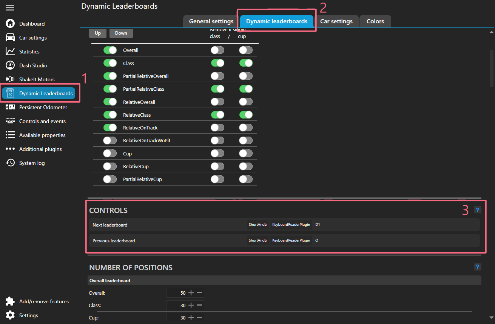

# Getting started

* Download the latest release from [OverTake][OverTakeDownload] or [GitHub][GitHubReleases].
* To install provided dashboard run {{ path("DynLeaderboard.simhubdash") }}.
* Copy all the files from folder {{ path("SimHub") }} to the SimHub root. (Likely located at {{ path("C:\\Program Files (x86)\\SimHub") }}) 
* Open SimHub and enable the "DynLeaderboardsPlugin".
* Assign controls to change leaderboard types.
    * Go to the plugin settings either directly from the left main menu "Dynamic Leaderboards" item or under "Additional plugins" item go to "DynLeaderboardsPlugin" tab.
    * Go to "Dynamic leaderboards" tab
    * Scroll down to "CONTROLS" section and assign controls for "Next leaderboard" and/or "Previous leaderboard".

    !!! info

        For mapping to controller inputs you need to enable "Controllers input" plugin and to keyboard inputs "Keyboard Input" plugin.

    
    
* Now the provided "DynLeaderboard" dash should work.

[OverTakeDownload]: https://www.racedepartment.com/downloads/acc-simhub-dynamic-leaderboards-plugin.50424/
[GitHubReleases]: https://github.com/kaiusl/KLPlugins.Leaderboard/releases

--8<-- "includes/abbreviations.md"